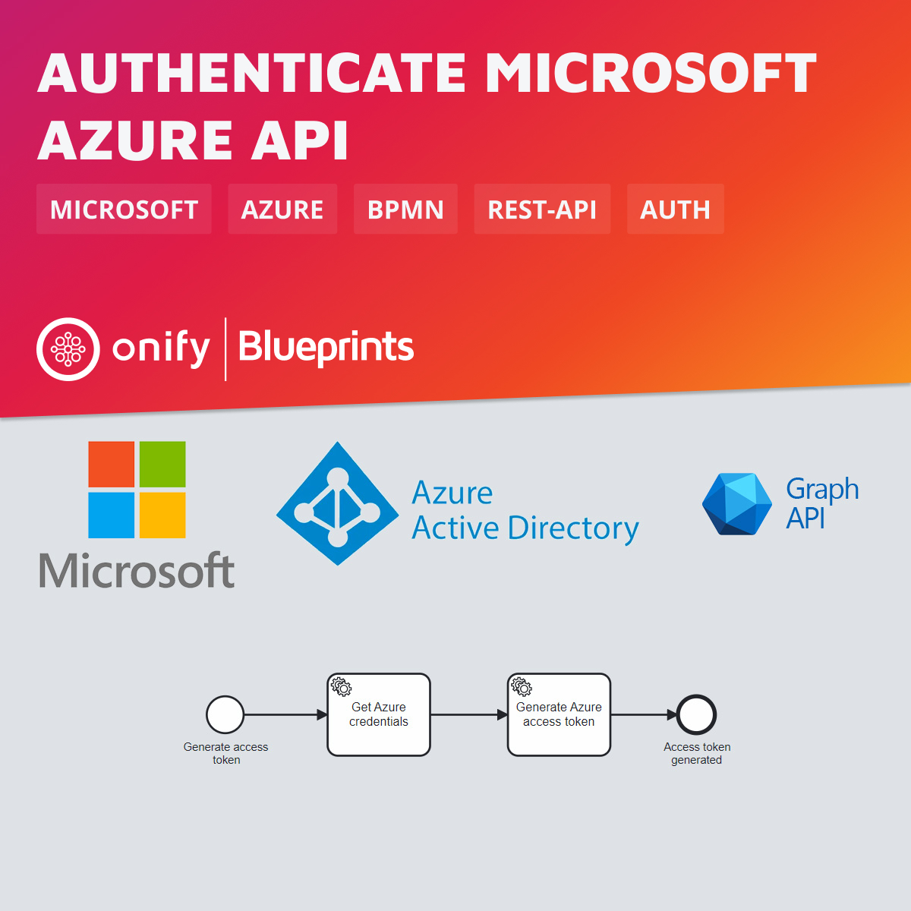

[](https://www.repostatus.org/#wip)

# Onify Blueprint: Authenticate against Microsoft Azure (AD) API using OAuth 2.0



## Requirements

* Onify Hub
* Onify Flow license
* Camunda Modeler

## Included

* 1 x Flows

## Setup

### Microsoft Azure

You must register a new app in `App registrations` in Azure AD.

1. Register your app (platform must be set to native (Mobile and desktop applications)).
2. Set API permissions (eg. for Microsoft Graph or Dynamics 365).
3. Grant admin consent.

> For more information about setting up Microsoft Graph/Azure API credentials, see https://docs.microsoft.com/en-us/graph/auth-v2-service.

### Onify

Add the following setting(s) to Onify.

_Replace `<TENANT>`, `<CLIENTID>` and `<CLIENTSECRET>` with correct values._

```json
{
  "key": "_azure_credentials",
  "name": "Microsoft Azure credentials",
  "value": "{\"tenant\":\"<TENANTID>\", \"client_id\":\"<CLIENTID>\", \"client_secret\":\"<CLIENTSECRET>\"}",
  "type": "object",
  "tag": [
    "azure",
    "credentials",
    "frontend"
  ],
  "category": "custom",
  "role": [
    "admin"
  ]
}
```

## Deploy

1. Open `microsoft-azure-api-authenticate.bpmn` in Camunda Modeler.
2. Change `form.scope` in `Generate Azure access token` task (optional). See https://learn.microsoft.com/en-us/azure/active-directory/develop/v2-permissions-and-consent for more info.
3. Click `Deploy current diagram` and follow the steps.

## Test

To test and run the flow, click `Start current diagram`.

## Support

* Community/forum: https://support.onify.co/discuss
* Documentation: https://support.onify.co/docs
* Support and SLA: https://support.onify.co/docs/get-support

## License

This project is licensed under the MIT License - see the [LICENSE](LICENSE) file for details.